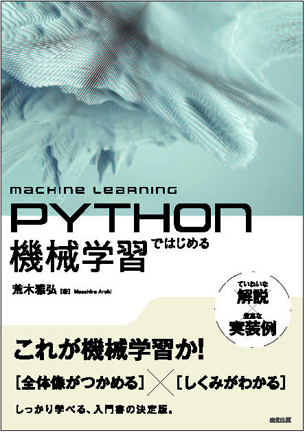

# Python ではじめる機械学習

- 著者：荒木雅弘
- 出版社：森北出版
- 出版年：2025 年
- 出版社の公式ホームページ：[https://www.morikita.co.jp/books/mid/085861](https://www.morikita.co.jp/books/mid/085861)
- 書影
  

## marimo

| Links |molab|
|--| --|
| [marimo の入門記事 (1)](https://note.com/mas_araki/n/n4fbcc8a74b08)|スライド |
| [marimo の入門記事 (2)](https://note.com/mas_araki/n/n77f80aa1e672)|スライド |
| [marimo の入門記事 (3)](https://note.com/mas_araki/n/n5917741fd6a9)|スライド |
|2章を元にしたコード|ノートブック |

## 章構成

## スライド

### 1. はじめに

<iframe src="https://www.docswell.com/slide/KVMWP3/embed" allowfullscreen="true" class="docswell-iframe" width="620" height="406" style="border: 1px solid #ccc; display: block; margin: 0px auto; padding: 0px; aspect-ratio: 620/406;"></iframe>

### 2. 機械学習の基本的な手順

<iframe src="https://www.docswell.com/slide/K13GYG/embed" allowfullscreen="true" class="docswell-iframe" width="620" height="406" style="border: 1px solid #ccc; display: block; margin: 0px auto; padding: 0px; aspect-ratio: 620/406;"></iframe>

### 3. 識別　ー概念学習ー

<iframe src="https://www.docswell.com/slide/ZG27LD/embed" allowfullscreen="true" class="docswell-iframe" width="620" height="406" style="border: 1px solid #ccc; display: block; margin: 0px auto; padding: 0px; aspect-ratio: 620/406;"></iframe>

### 4. 識別　ー統計的手法ー

<iframe src="https://www.docswell.com/slide/59MPGX/embed" allowfullscreen="true" class="docswell-iframe" width="620" height="406" style="border: 1px solid #ccc; display: block; margin: 0px auto; padding: 0px; aspect-ratio: 620/406;"></iframe>

### 5. 識別　ー生成モデルと識別モデルー

<iframe src="https://www.docswell.com/slide/KLVYG4/embed" allowfullscreen="true" class="docswell-iframe" width="620" height="406" style="border: 1px solid #ccc; display: block; margin: 0px auto; padding: 0px; aspect-ratio: 620/406;"></iframe>

### 6. 回帰

<iframe src="https://www.docswell.com/slide/ZPG1ME/embed" allowfullscreen="true" class="docswell-iframe" width="620" height="406" style="border: 1px solid #ccc; display: block; margin: 0px auto; padding: 0px; aspect-ratio: 620/406;"></iframe>

### 7. サポートベクトルマシン

<iframe src="https://www.docswell.com/slide/ZX6JPM/embed" allowfullscreen="true" class="docswell-iframe" width="620" height="406" style="border: 1px solid #ccc; display: block; margin: 0px auto; padding: 0px; aspect-ratio: 620/406;"></iframe>

### 8. ニューラルネットワークの基礎

<iframe src="https://www.docswell.com/slide/5DW8GD/embed" allowfullscreen="true" class="docswell-iframe" width="620" height="406" style="border: 1px solid #ccc; display: block; margin: 0px auto; padding: 0px; aspect-ratio: 620/406;"></iframe>

### 9. ニューラルネットワークの応用

<iframe src="https://www.docswell.com/slide/KWM7V1/embed" allowfullscreen="true" class="docswell-iframe" width="620" height="406" style="border: 1px solid #ccc; display: block; margin: 0px auto; padding: 0px; aspect-ratio: 620/406;"></iframe>

### 10. アンサンブル学習

<iframe src="https://www.docswell.com/slide/ZRERG2/embed" allowfullscreen="true" class="docswell-iframe" width="620" height="406" style="border: 1px solid #ccc; display: block; margin: 0px auto; padding: 0px; aspect-ratio: 620/406;"></iframe>

### 11. モデル推定

<iframe src="https://www.docswell.com/slide/52QP8M/embed" allowfullscreen="true" class="docswell-iframe" width="620" height="406" style="border: 1px solid #ccc; display: block; margin: 0px auto; padding: 0px; aspect-ratio: 620/406;"></iframe>

### 12. パターンマイニング

<iframe src="https://www.docswell.com/slide/Z8WP11/embed" allowfullscreen="true" class="docswell-iframe" width="620" height="406" style="border: 1px solid #ccc; display: block; margin: 0px auto; padding: 0px; aspect-ratio: 620/406;"></iframe>

### 13. 系列データの学習

<iframe src="https://www.docswell.com/slide/537W3E/embed" allowfullscreen="true" class="docswell-iframe" width="620" height="406" style="border: 1px solid #ccc; display: block; margin: 0px auto; padding: 0px; aspect-ratio: 620/406;"></iframe>

### 14. 少量データ学習

<iframe src="https://www.docswell.com/slide/ZQXWMX/embed" allowfullscreen="true" class="docswell-iframe" width="620" height="406" style="border: 1px solid #ccc; display: block; margin: 0px auto; padding: 0px; aspect-ratio: 620/406;"></iframe>

### 15. 強化学習

<iframe src="https://www.docswell.com/slide/574PEN/embed" allowfullscreen="true" class="docswell-iframe" width="620" height="406" style="border: 1px solid #ccc; display: block; margin: 0px auto; padding: 0px; aspect-ratio: 620/406;"></iframe>